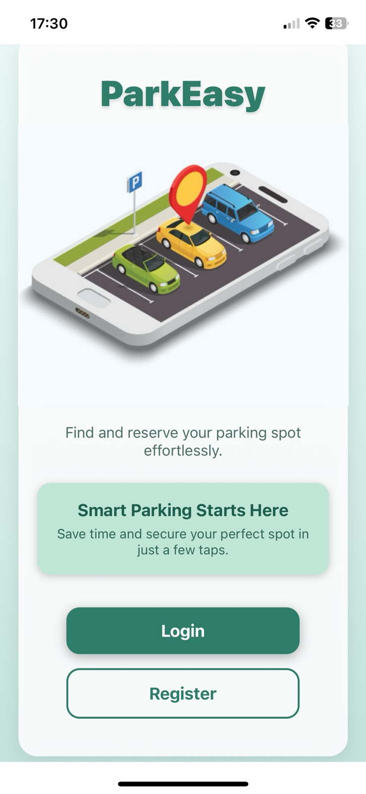
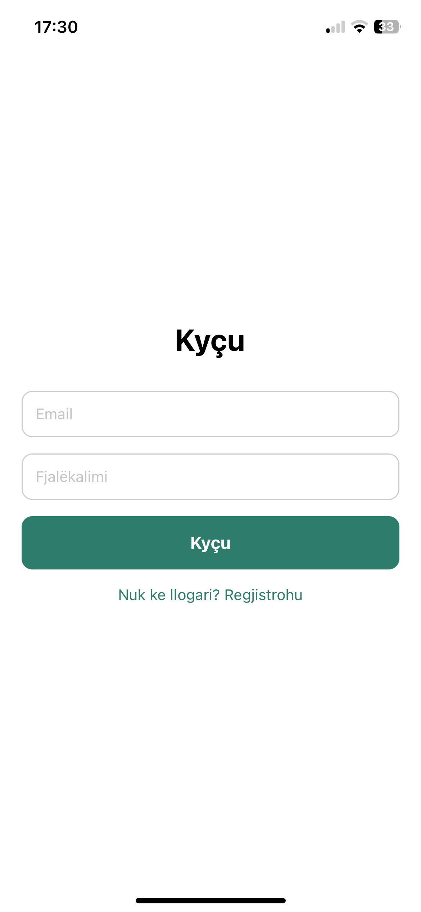
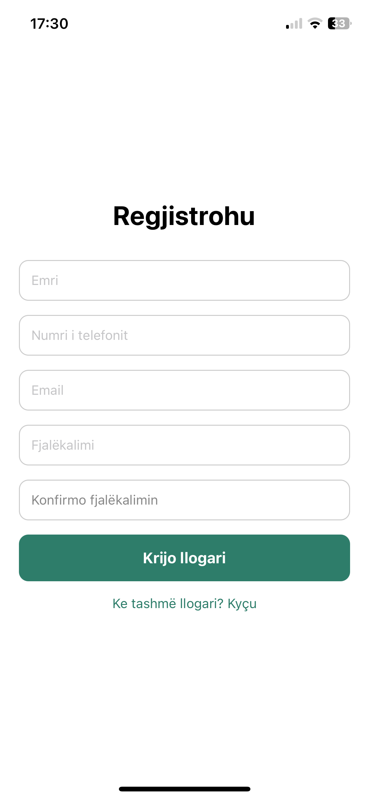
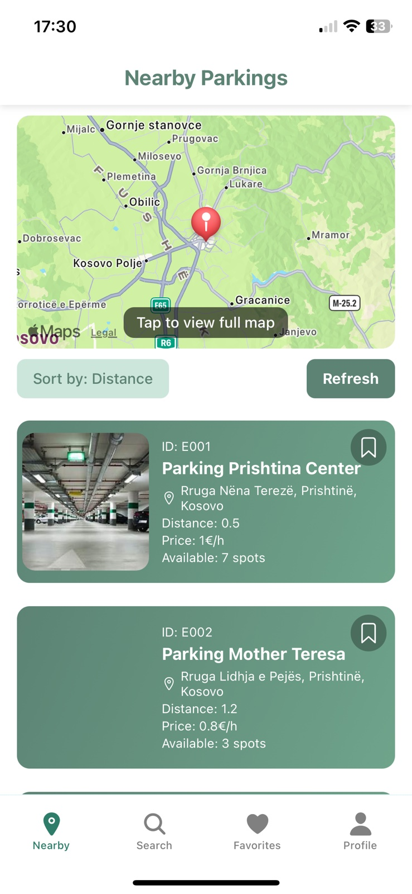
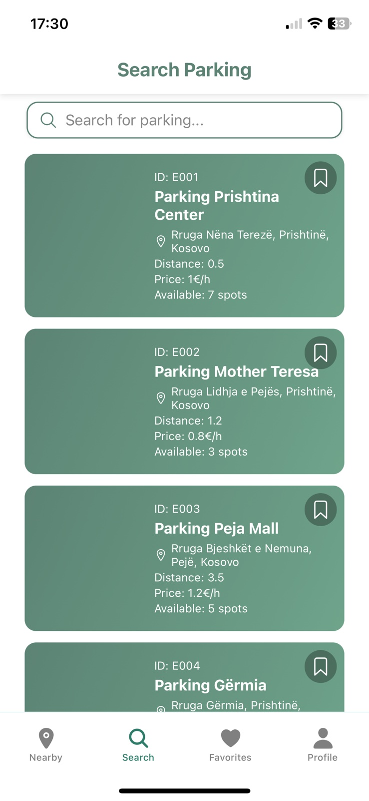
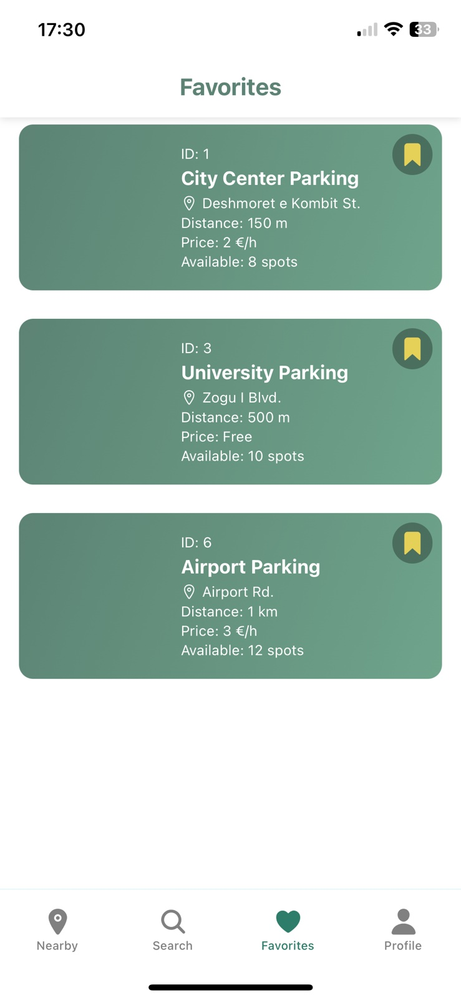
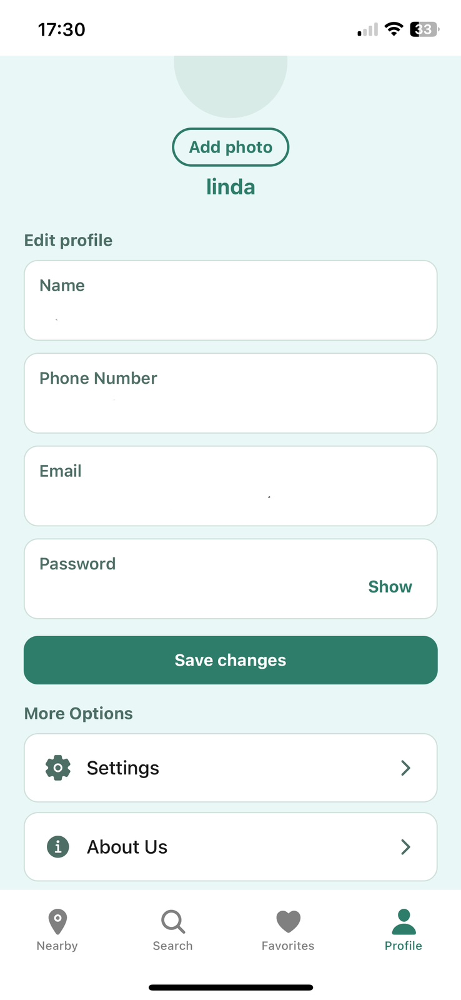

# Phase 1 – ParkEasy – Parking App Prototype

**Technology:** Node.js + Expo/React Native  

This project, developed by third-year Computer Engineering students at FIEK, is a prototype of a mobile parking management app. It provides screen views for navigation between locations, searching for parking spots, saving favorite spots, and managing the user profile for now.

## Developed by
- Arila Behrami  
- Edonita Gashi  
- Erza Duraku  
- Engji Osmani  
- Albi Kallaba  
- Fatlinda Osdautaj  

## Clone the Repository
```bash
git clone https://github.com/edonitagashi/ParkEasy.git 
```

## Project Description

ParkEasy is a mobile app prototype built using Node.js and Expo/React Native. Currently, it does **not** connect to a database (e.g., Firebase) but demonstrates the UI and screen navigation.

The app features four main sections in a tab bar:

- **Nearby** – Displays a map with nearby parking spots.  
- **Search** – Allows users to search for specific parking spots.  
- **Favorites** – Saves frequently used or favorite parking spots.  
- **Profile** – Shows user information and additional options like Settings, Help, About Us.  

## Key Functionalities

- **Nearby Map:** Display of parking spots on a map with the option to save locations.  
- **Search Parking:** Search for parking spots by name or location.  
- **Favorites:** List of favorite parking spots for easy access.  
- **Profile Management:** View user information and access additional options (Settings, Help, About Us).  
- **Navigation:** Tab bar allows quick switching between the four main sections.  

## How to Run the Prototype

1. **Clone the repository:**
```bash
git clone https://github.com/edonitagashi/ParkEasy.git
```
2. **Install the dependencies:**
```bash
cd ParkEasy
npm install
```
3. **Start the app using Expo:**
```bash
npx expo start
```
## QR Code


## Screenshots

<p align="center">
  
  
  
  
  
  
  
</p>


## Conclusion

This is the initial prototype of the parking management app, developed in accordance with the requirements of the first phase of the “Mobile Device Programming” course project, demonstrating screen navigation, saving preferences, and map integration without a backend or database connection.


# Phase 2 – Functional Version with Firebase Integration

In the second phase of the project, the ParkEasy application becomes a fully functional system by integrating Firebase Authentication and Firestore Database. Users can now register, log in, reserve parking spots, save favorites, manage bookings, and interact with real-time data. The system also includes dedicated functionality for Admin and Owner roles.

**Technology:** Node.js + Expo/React Native + Firebase (Auth & Firestore)

This version adds backend integration, real data operations, and improved UI/UX compared to Phase 1.

---

## Key Functionalities

---

## **1. Authentication (Firebase Authentication)**

The app implements secure authentication with two methods:

- **Email / Password Login**  
- **Google Login (GoogleAuthProvider)**  

User input is validated during registration and login.  
After successful authentication, users are redirected based on their role:

- **User → Nearby screen**  
- **Owner → Owner Home screen**  
- **Admin → Admin Dashboard**

Logout functionality is also available in the Profile screens.

---

## **2. CRUD with Firestore (Create, Read, Update, Delete)**

Cloud Firestore is used as the main backend database, enabling full CRUD for all dynamic data in the app.

### **Users**
- User roles are stored in `/users/{uid}`  
- Users can update their profile information  

### **Bookings (User)**
- Create booking → **BookParkingScreen**  
- View bookings in real time → **BookingsScreen**  
- Update booking → **EditBookingScreen**  
- Delete booking → Firestore delete  

### **Favorites**
- Managed in `/favorites/{uid}`  
- Users can save/remove favorite parkings  
- Real-time updates via `onSnapshot`  
- Optimistic UI for instant feedback  

### **Parkings (Admin + Owner)**
- Admin can view, edit, or delete parkings  
- Owner can edit their own parking  
- When a request is approved, a new parking record is created  

### **Owner Requests**
- Users can apply to become parking owners  
- Admin can approve or reject applications  
- Approved requests automatically create a new parking in Firestore  

---

## **3. External API (Optional Feature)**

An external **Weather API** is integrated in the Nearby Web version, displaying real-time weather information.

---

## Screenshots

<p align="center">
  
  
  
  
  
  
  
  
  
  
  
  
  
  
  
  
</p>

---

## Conclusion

Phase 2 upgrades ParkEasy into a complete, data-driven parking management application. With secure authentication, real-time Firestore CRUD, and role-based access, the app now supports full booking, favorites, and parking administration features for Users, Owners, and Admins — fully meeting the requirements of the second project phase.
