# ParkEasy - Mobile Parking Management App

ParkEasy is a comprehensive mobile parking management application developed as part of the **Mobile Application Programming** course at FIEK (Faculty of Computer Engineering and Information Technology). This project implements essential mobile development concepts and best practices, including Firebase integration, real-time data synchronization, role-based authentication, and modern UI/UX design.

Throughout the course, we have implemented some of the most important tasks and features required for mobile application development. In the final phase, we focused on critical improvements including map functionality fixes, notification system implementation, image picker enhancements, UI animation refinements, and comprehensive testing to ensure a polished, production-ready application.

## Developed by

* Edonita Gashi 
* Fatlinda Osdautaj
* Erza Duraku
* Engji Osmani
* Albi Kallaba
* Arila Behrami

## What ParkEasy Offers

ParkEasy revolutionizes parking management in Kosovo by providing a seamless, real-time platform where drivers can discover, reserve, and manage parking spots while owners can efficiently manage their parking spaces. The application features role-based access for Users, Owners, and Administrators, ensuring a tailored experience for each stakeholder in the parking ecosystem.

## 🚗 User Features

 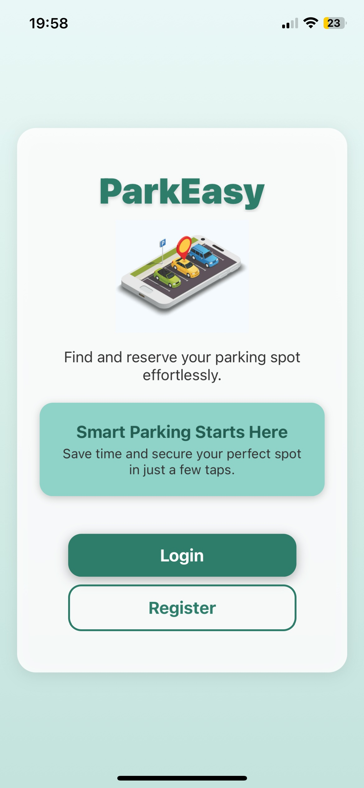
   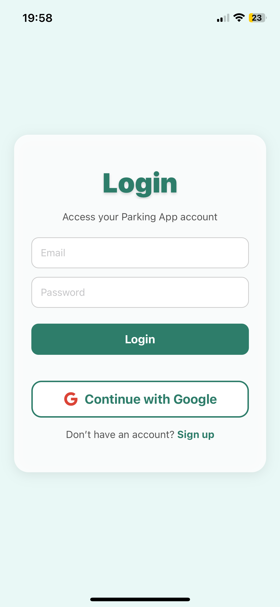
     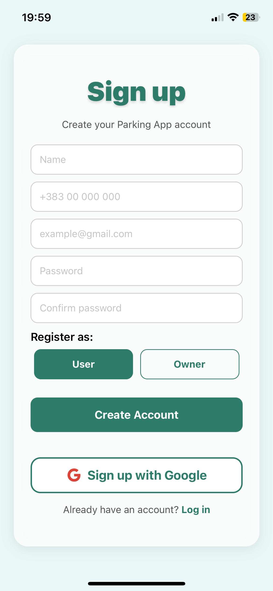
          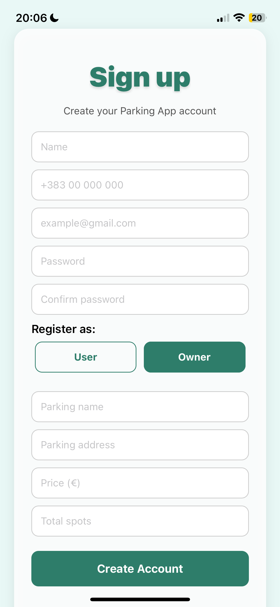

### Nearby
*Real-time map view with available parking spots*

  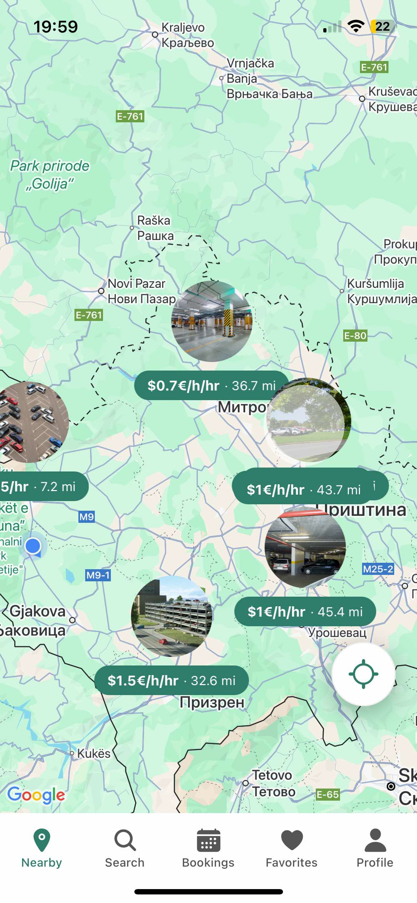
   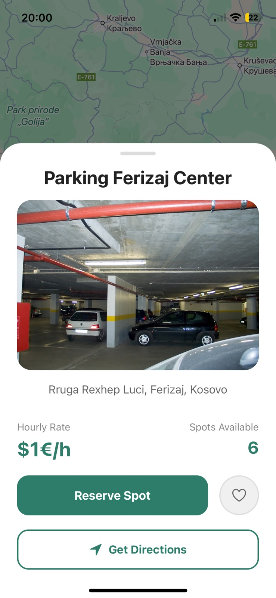

### Search
*Advanced search functionality for parking locations*

 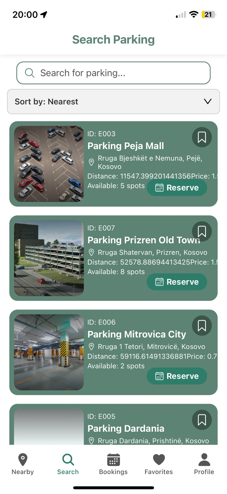
   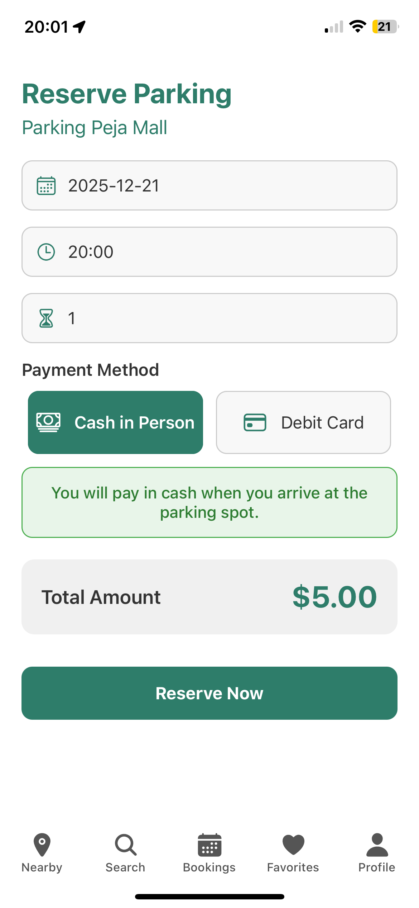

### Bookings
*Manage reservations and booking history*

 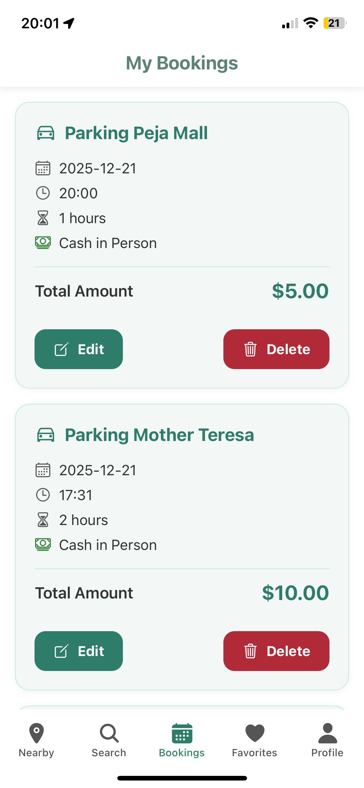
   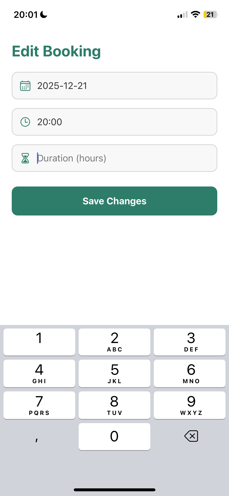
    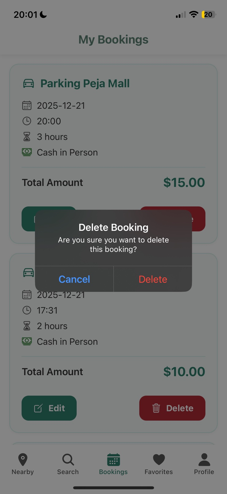

### Favorites
*Save and access preferred parking locations*

 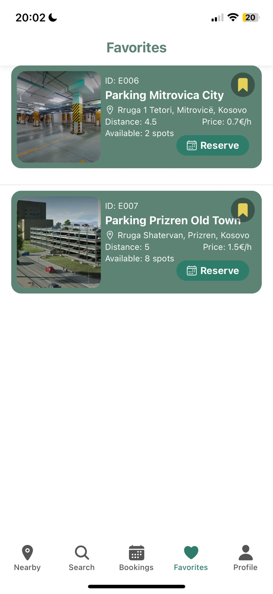

### Profile
*User account management and settings*

 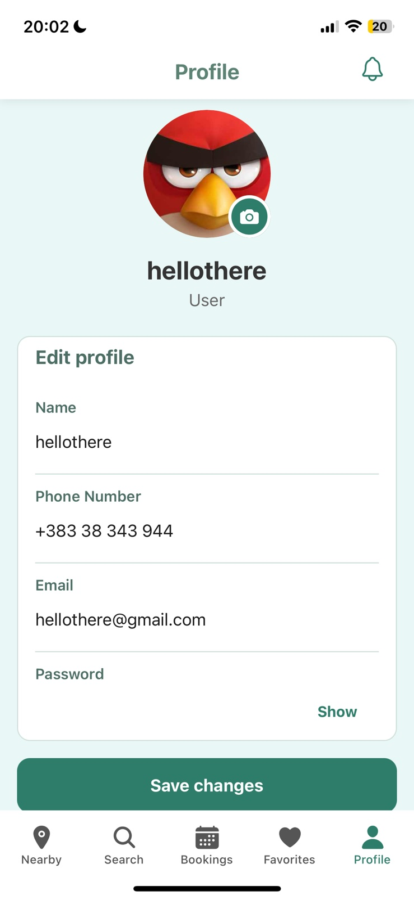
   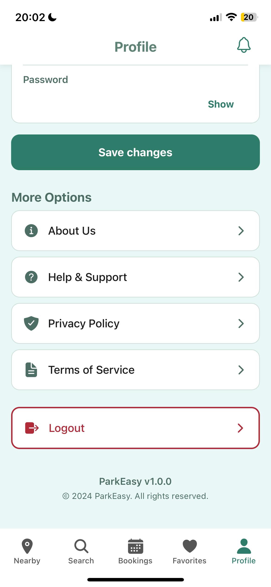
     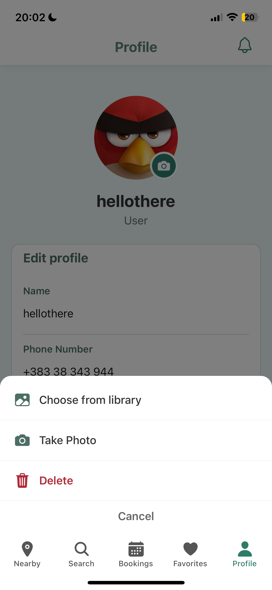
      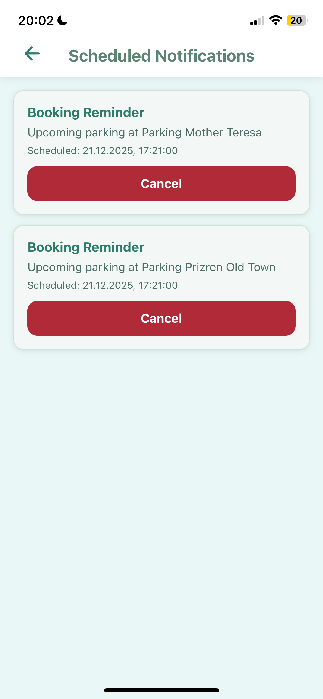

## 🏢 Owner Features
### Dashboard
*Overview of parking spaces and earnings*

 

### Profile
*Owner account and business information*

   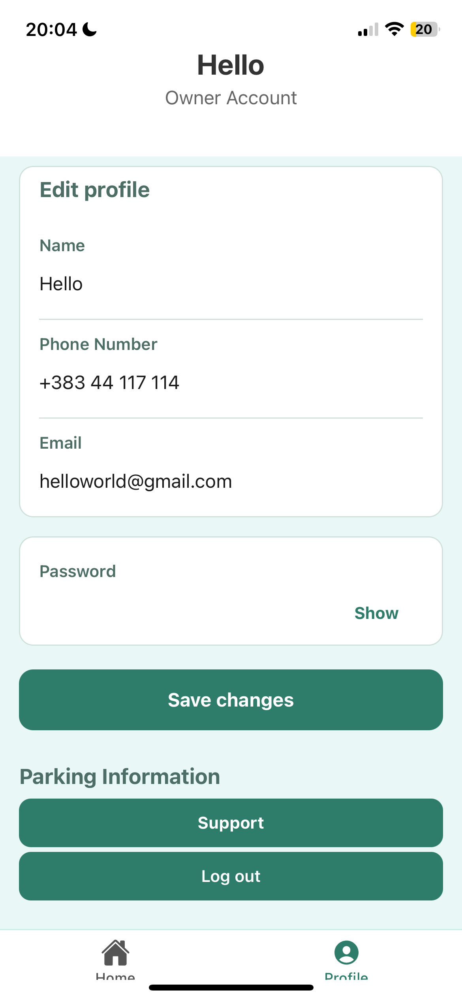

## 👨‍💼 Admin Features

### Dashboard

   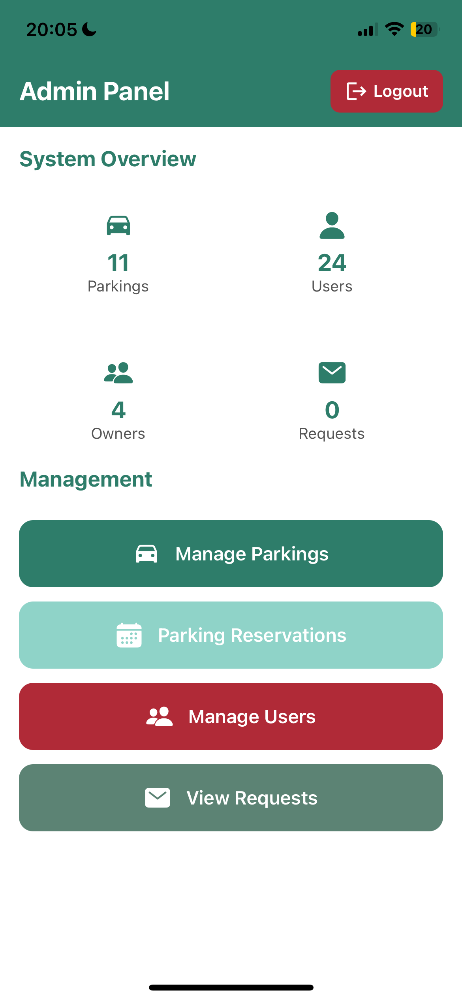
     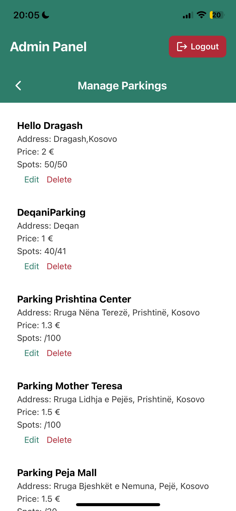
          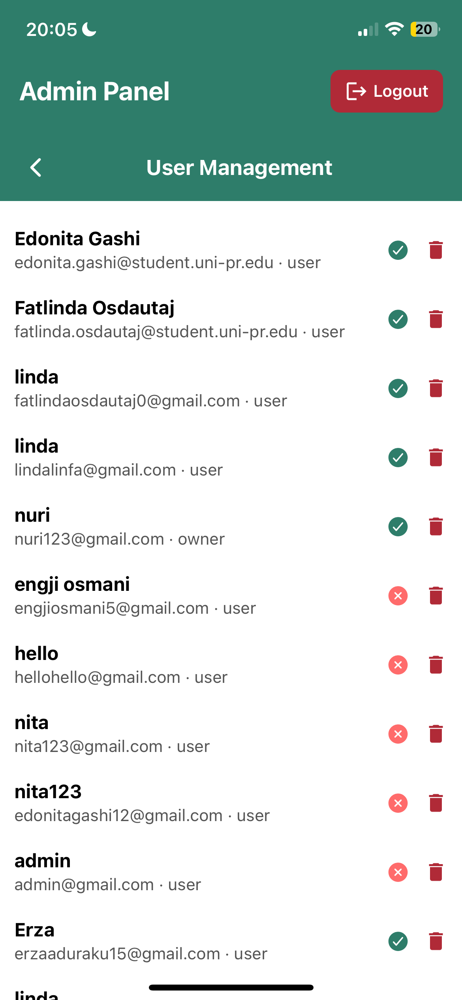

## Tech Stack

- **Frontend**: React Native 0.72+ with Expo
- **Backend**: Firebase (Auth, Firestore, Storage)
- **Navigation**: React Navigation
- **Styling**: Custom theme system
- **Testing**: Jest with React Native Testing Library

## Key Functionalities

ParkEasy offers a comprehensive set of features designed to streamline parking management:

- **User Authentication**: Secure login and registration with role-based access (User, Owner, Admin)
- **Real-time Map Integration**: Interactive maps showing nearby parking spots with availability
- **Advanced Search**: Location-based search for parking spaces with filters
- **Booking Management**: Reserve, edit, and cancel parking bookings with history tracking
- **Favorites System**: Save preferred parking locations for quick access
- **Profile Management**: User profiles with photo upload and notification settings
- **Owner Dashboard**: Manage parking spaces, view earnings, and handle reservations
- **Admin Panel**: Oversee parking requests, user management, and system-wide reservations
- **Notifications**: Real-time alerts for booking confirmations and updates
- **Image Handling**: Optimized image uploading and display for parking photos
- **Cross-platform Compatibility**: Built with React Native for iOS and Android

## Quick Start

### Prerequisites
- Node.js 18+
- Expo CLI (`npm install -g @expo/cli`)
- Firebase project

### Setup
1. Clone the repo: `git clone https://github.com/edonitagashi/ParkEasy.git`
2. Install dependencies: `npm install`
3. Configure Firebase in `firebase/firebase.js`
4. Run: `npx expo start`

### Testing
- Install Expo Go app on device
- Scan QR code to test on physical device

## Conclusions

This project, developed as part of the Mobile Application Programming course at FIEK, successfully completed 100% of the assigned tasks and goals. The implementation demonstrates proficiency in React Native development, Firebase integration, and modern mobile app best practices, resulting in a fully functional parking management system.

---

*ParkEasy - Making parking in Kosovo smarter and easier!* 🇽🇰
